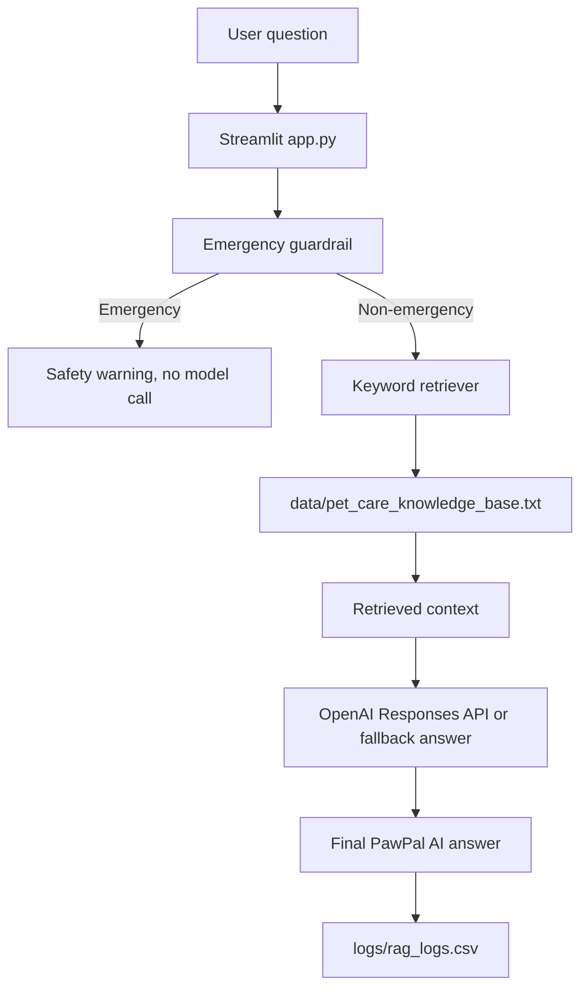

# PawPal AI Pet Care Assistant

PawPal is a Streamlit pet-care scheduling app with an added "Ask PawPal AI" feature. The AI feature uses Retrieval-Augmented Generation (RAG) to answer pet-care questions from a small local guide before calling an AI model.

The original scheduling features are still included: users can add pets, create tasks, view today's schedule, mark tasks complete, and filter tasks.

## Demo Link
https://youtu.be/-eWEbfEgfSA

## RAG Architecture

The RAG flow is intentionally simple and beginner-friendly:

1. The user asks a pet-care question in the Streamlit app.
2. PawPal checks for emergency keywords such as trouble breathing, seizure, collapse, poisoning, bleeding, choking, or repeated vomiting.
3. If the question may be an emergency, PawPal shows a veterinarian safety warning and does not call the model.
4. For non-emergency questions, PawPal loads `data/pet_care_knowledge_base.txt`.
5. `utils/rag.py` splits the guide into sections and scores them by keyword overlap with the user question.
6. The top matching sections are used as retrieved context.
7. PawPal calculates a confidence score from keyword overlap between the question and retrieved context.
8. If an OpenAI API key is available, PawPal sends the question and retrieved context to the OpenAI Responses API.
9. If no API key is available or the model call fails, PawPal still returns a fallback answer based on the retrieved context.
10. Each non-empty question is logged to `logs/rag_logs.csv` with the timestamp, question, retrieved context, confidence score, final answer, emergency status, and any error message.



## Reliability Features

PawPal includes a simple confidence score so the app can show how closely the retrieved guide context matches the user's question. The score is based on keyword overlap:

- `0.8-1.0`: strong match
- `0.5-0.79`: medium match
- below `0.5`: low confidence

When confidence is low, the app warns that PawPal found limited matching information and recommends checking with a veterinarian or trusted pet-care source. This helps separate grounded answers from answers based on weak retrieved context.

The app also saves a reliability log to `logs/rag_logs.csv`. Each row includes the timestamp, user question, retrieved context, confidence score, final answer, whether the emergency guardrail was triggered, and any model/API error message.

## Project Structure

```text
app.py
pawpal_system.py
data/
  pet_care_knowledge_base.txt
logs/
  rag_logs.csv
utils/
  rag.py
requirements.txt
tests/
```

## Setup

Create and activate a virtual environment:

```bash
python3 -m venv venv
source venv/bin/activate
```

Install dependencies:

```bash
pip install -r requirements.txt
```

## API Key

PawPal supports either an environment variable or Streamlit secrets. Do not commit API keys to GitHub.

Environment variable:

```bash
export OPENAI_API_KEY="your-api-key"
```

Streamlit secrets:

```toml
# .streamlit/secrets.toml
OPENAI_API_KEY = "your-api-key"
```

The app still works without an API key by returning a fallback answer from the retrieved guide context.

## Run

```bash
streamlit run app.py
```

Then open the local URL shown in the terminal, usually `http://localhost:8501`.

## Run Tests

```bash
python -m pytest tests/test_rag.py
```

The RAG tests check that emergency detection works for dangerous symptoms, normal walking questions do not trigger emergency mode, exercise and feeding questions retrieve relevant context, fallback answers work without an API key, and logging includes reliability fields.

## Sample Interactions

Question:

```text
How often should I walk my dog?
```

Expected behavior: PawPal retrieves the `[Exercise]` section and answers that most dogs benefit from daily walks, with a common starting point of 20-30 minutes once or twice daily.

Question:

```text
My dog skipped dinner, what should I do?
```

Expected behavior: PawPal retrieves the `[Feeding]` section and explains that skipping one meal while acting normal can usually be monitored, but appetite loss lasting more than 24 hours or symptoms like vomiting, weakness, diarrhea, or behavior changes should lead to contacting a veterinarian.

Question:

```text
My cat is having trouble breathing.
```

Expected behavior: PawPal shows the emergency warning and does not call the model.

## Guardrails

PawPal is not a veterinarian and does not diagnose medical problems. Emergency-related questions return this message:

```text
This may be an emergency. PawPal cannot diagnose medical problems. Please contact a veterinarian or emergency animal clinic immediately.
```

The emergency check currently uses keyword and phrase matching. It is easy to understand and test, but it may not catch every urgent situation.

## Testing Summary

PawPal AI includes automated tests for emergency detection, retrieval relevance, fallback answer generation, and reliability logging. In testing, the system performed well on clear pet-care questions such as feeding and exercise prompts. The main limitation was that confidence drops when the user asks about a topic not covered in the local knowledge base. This showed that the quality of a RAG system depends heavily on the quality and coverage of its source documents.

## Reflection and Ethics

PawPal AI is limited by the small local knowledge base included in the project. If the knowledge base does not include a topic, the system may retrieve weak context or produce a less useful answer. The system may also reflect bias toward general pet-care advice and may not account for differences in breed, age, medical history, or individual pet needs.

This AI could be misused if someone treats it as a replacement for a veterinarian. To reduce that risk, I added emergency guardrails and designed the assistant to avoid diagnosis. For serious or persistent symptoms, the app directs users to contact a veterinarian or emergency animal clinic.

While testing reliability, I was surprised by how much the retrieved context affected the answer quality. When the retriever found a strong match, the response was much clearer and safer. When the context was weak, the system needed a confidence warning so users would know the answer might be less reliable.

I collaborated with AI during this project by using it to brainstorm the RAG architecture, draft helper functions, and improve documentation. One helpful suggestion was adding a local pet-care knowledge base so the app could ground its answers in retrieved context instead of relying only on a general model response. One flawed suggestion was initially treating the AI response as reliable without enough testing, which led me to add confidence scoring, logging, and automated tests.
